# progress

**01 · first go.** camera's inside the rock here, so the tunnels show up as blobs. all the little cubes are ore, buried in the walls where you can't mine them

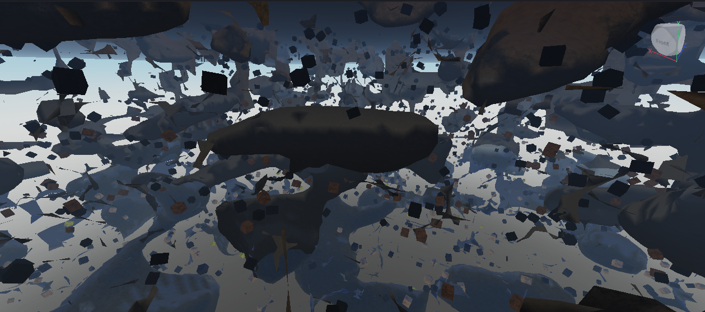

**02 · rock layers.** top of the mine from above, sandstone on top with the tunnels breaking through

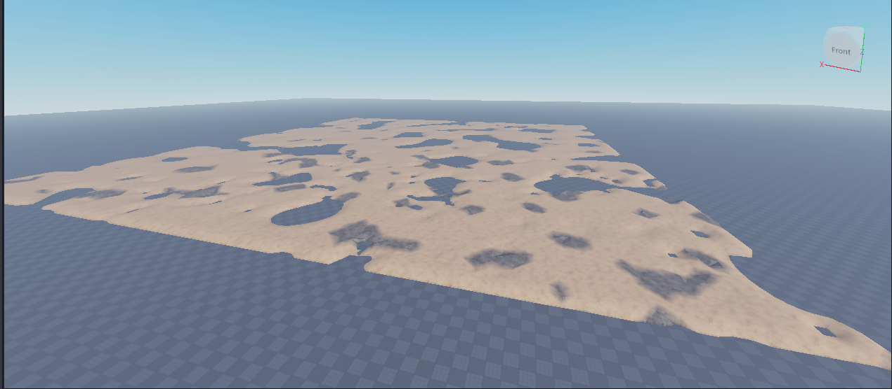

**03 · ore clumps.** ores are clumps now instead of single cubes, but i kept spawning inside solid rock so everything looked inside out. turns out the spawn point was just a fixed spot and it's rock most of the time

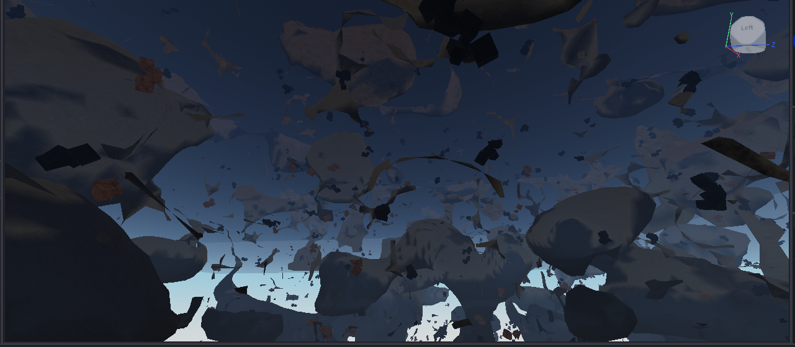

**04 · tried raycasting the ores onto the walls.** 0 placed, 2080 skipped. raycasts don't see terrain you just wrote in edit mode. did at least prove the terrain matches the code 300/300, so the cave maths was fine all along

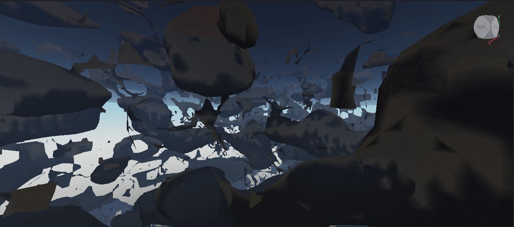

**05 · tunnel network.** threw out the noise blobs, they could never guarantee every cave connects. now every chunk has a node and tunnels link the nodes, so it's one connected web. way too thin and way too grid-like though

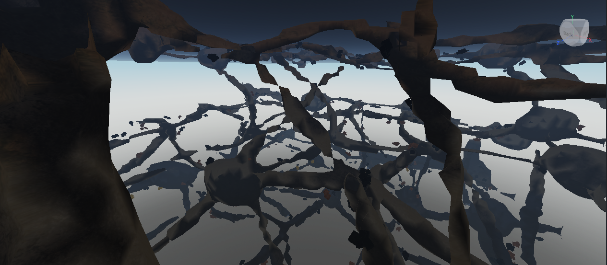

**06 · ores actually in the tunnels.** wider tunnels, and the ores get pushed 2 studs out of the wall because roblox draws the wall further in than the maths says. first time you can walk up to one. still way too dark though

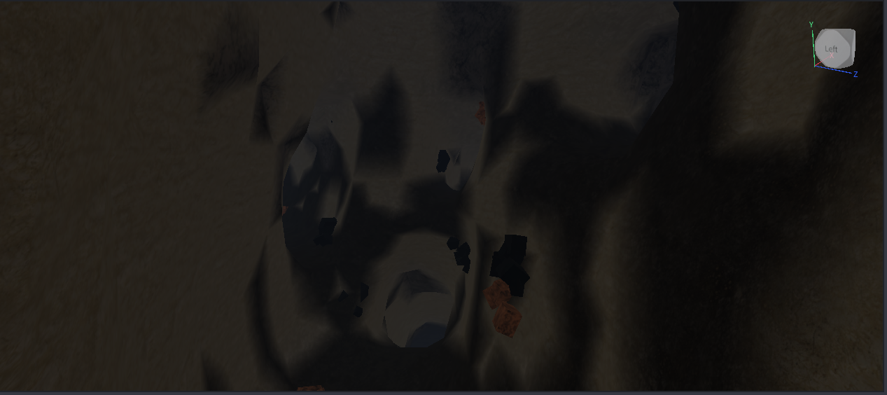

**07 · lighting.** lantern on a chain at every junction, gold and diamond glow, warm haze, bloom. switched lighting to Future for the shadows. finally looks like a mine

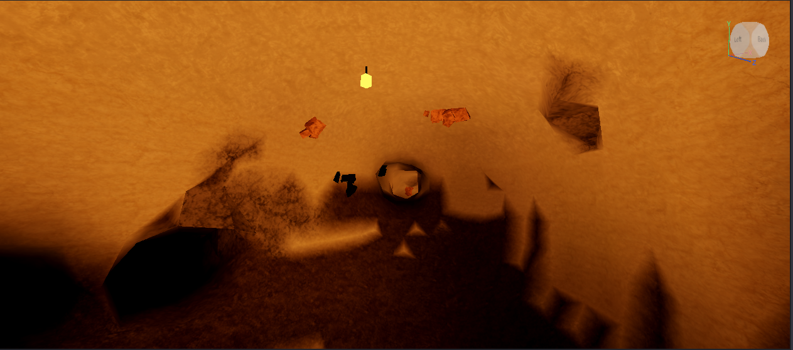

**09 · spawn room.** pressing play just dropped you forever, the server moved you before the terrain reached your computer. now there's a dug-out room with a real spawn pad and you only spawn once the mine's loaded. works, but it's cramped and everything's the same orange

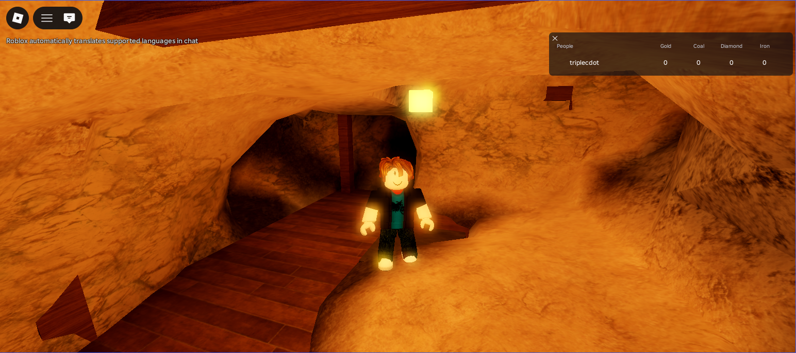

**10 · bigger spawn room, striped rock.** 40x40 with a dome, dug out under the floor so the terrain stops creeping over the planks. rock has thin stripes through each layer now and the light's warm white instead of orange

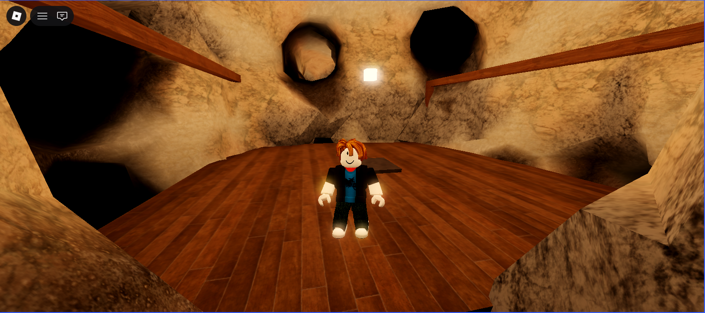

**11 · the deep end.** below about -280 the walls turn to cracked lava. diamond only shows up down here

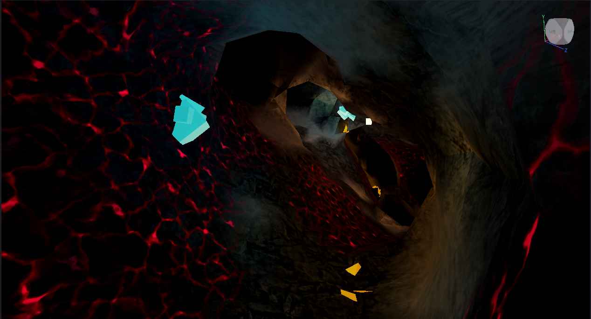

**12 · caverns.** 1 junction in 14 is a huge flattened dome with rock pillars instead of a normal chamber. seen from outside here so you can see how many there are. the pillars left a few single-voxel air bubbles in the sim, so lone air voxels get filled back in

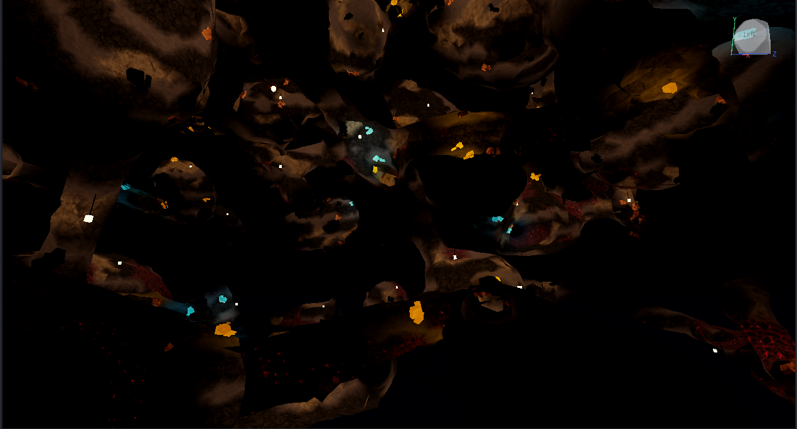

**13 · crystal caves.** big regions of the mine turn into basalt and violet ice with neon crystals growing out of every surface. they light themselves so there's no lanterns down here

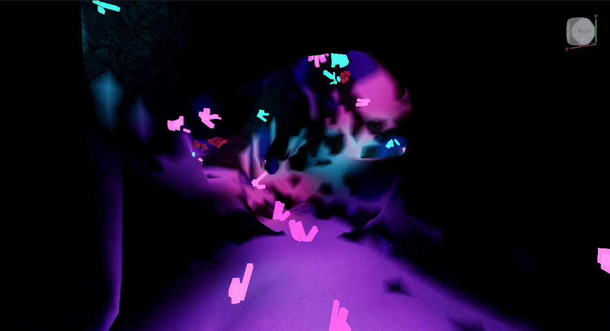

**14 · where the biomes meet.** crystal on the left running into plain striped rock on the right. there's mushroom caves too, mossy floors and glowing mushrooms

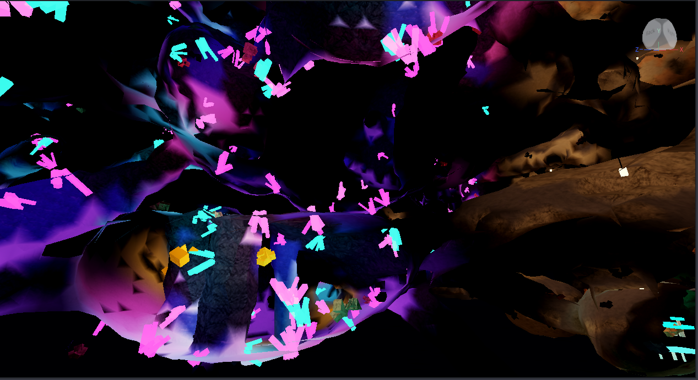

**15 · digging.** hold click on rock and you carve through it, dust comes off in the rock's colour. first version wouldn't let you dig the spawn room walls, which is exactly where you try it first, so that rule's gone

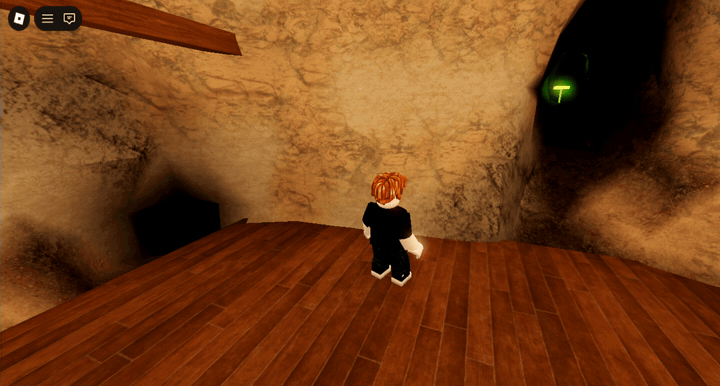

**16 · mushroom caves.** the other biome. mud walls, mossy floor, and glowing mushrooms that light the tunnel instead of lanterns

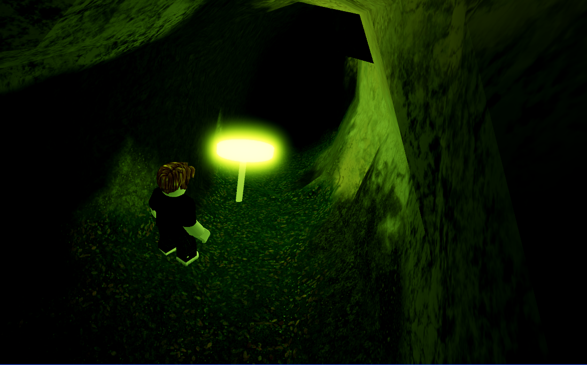

**17 · decoration.** stalactites, stalagmites, rubble and little puddles (bottom left) in the plain rock bits, coloured to match the rock. the spikes look a bit like stacked boxes, roblox has no cone shape. going back to them

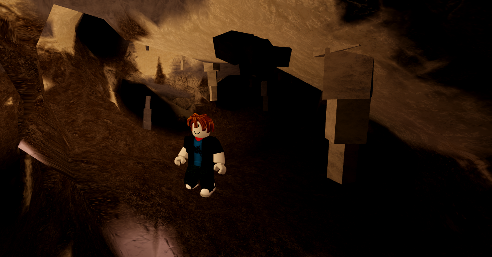

**18 · digging through crystals.** digging used to leave ore and crystals floating in the air. now anything you dig the rock out from under breaks, ore counts as mined, the rest shatters. also chunks unload when you're far away now and your digging comes back when they reload

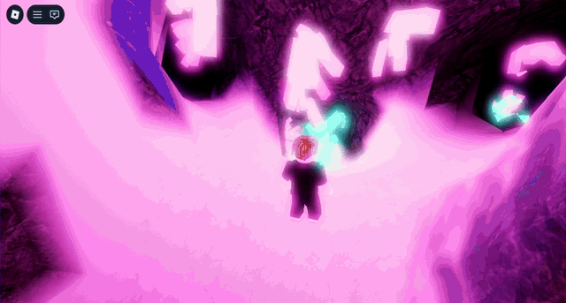
