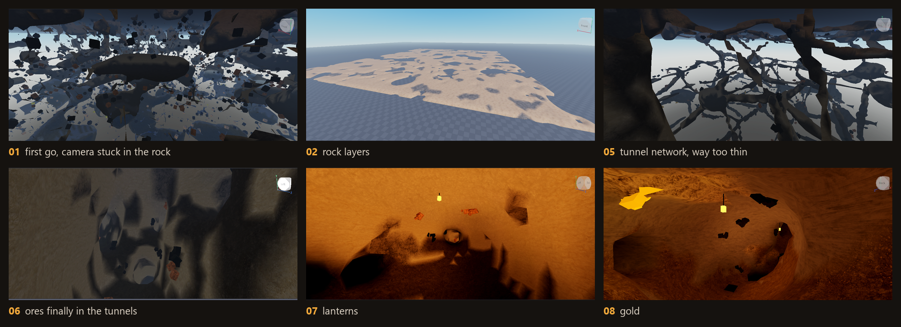

# Cave

procedural mines for roblox. tunnels generate around you as you explore, every cave connects to every other one, and ore grows on the walls.

- terrain tunnels and chambers built as one connected network, so there's never a sealed-off pocket
- rock changes with depth: sandstone, limestone, slate, basalt, then lava at the bottom
- coal, iron, gold and diamond on the tunnel walls. gold and diamond glow
- a lantern at every junction
- generates in chunks around players, or in edit mode with `Cave.preview()` so you can fly around it

## setup

1. put `Cave.luau` in ServerScriptService as a ModuleScript called `Cave`
2. put `Test.server.luau` next to it as a Script. it builds the area around a tunnel and spawns you in it
3. set `Lighting.Technology` to Future (scripts can't change it)

everything you'd want to tweak is in `Cave.settings` at the top of the module.

## how it got here

every screenshot with what went wrong at each step is in [PROGRESS.md](PROGRESS.md). the change log is in [CHANGES.md](CHANGES.md).
