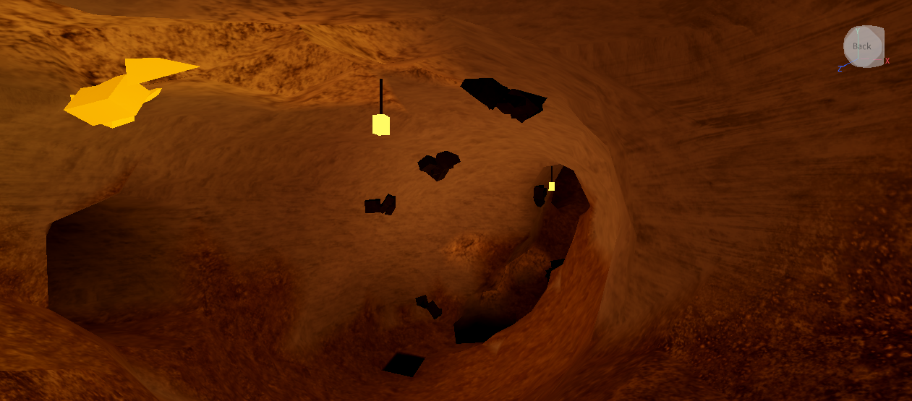

# Cave

procedural mines for roblox. every server gets a new one. tunnels generate around you as you explore, every cave connects to every other one, and ore grows on the walls.

**[play it on roblox](https://www.roblox.com/games/115998376881963/Procedural-cave)**

## what's in it

- a new mine every server, seed shown in the corner so you can share a good one
- terrain tunnels, chambers and the odd huge cavern with rock pillars, all one connected network so there's never a sealed-off pocket
- the network's a random tree per region with loops added on top, so you get dead ends, hubs where 4+ tunnels meet, and more than one way round. `Cave.stats()` prints the numbers for the current seed
- deep chasms through several layers with rope bridges wherever a tunnel comes out
- lava tubes deep down: long smooth round tunnels with a glowing cracked-lava floor
- geodes: hollow crystal-lined balls sealed in solid rock. a faint sparkle on a nearby wall is the only clue, you have to dig in
- a surface over the top: rolling hills at night with grass, bare rock where it's steep, moonlight and fireflies. cave mouths come out of the hillsides with a timber frame and a lantern
- sinkholes: round shafts from the surface down through several layers, with a torch-lit spiral ledge you can walk down
- underground rivers winding downhill between junctions, with real water, drifting foam, and waterfalls where they spill into a chasm
- rock changes with depth: sandstone, limestone, slate, basalt, then lava at the bottom
- biomes: plain rock with lanterns, crystal caves, mushroom caves and caves full of little tide pools
- stalactites, stalagmites and rubble in the plain rock bits
- water settles in the real dips in the floor, only where it's walled in, with a pale flowstone rim round it. mineral streaks run down the walls
- coal, iron, gold and diamond on the walls. they grow back after you mine them and your counts save
- a spawn room with a minecart, crates and a lit first tunnel with easy ore in it
- chunks load nearest first around players and unload when nobody's near. anything you dig stays dug

## controls

equip the pickaxe (1) and hold click. hit ore to mine it, hit rock to dig through it. F throws a flare.

it's properly dark down there. you've got a helmet lamp, and the big caverns have glowworms all over the ceiling.

## setup

with [rojo](https://rojo.space): `rokit install`, then `rojo serve` and hit connect in the studio plugin. everything goes in the right place and lighting gets set to Future.

or by hand:

1. `src/Cave.luau` goes in ServerScriptService as a ModuleScript called `Cave`
2. `src/Start.server.luau` goes next to it as a Script
3. `src/Pickaxe.client.luau`, `src/Atmosphere.client.luau` and `src/Props.client.luau` go in StarterPlayerScripts as LocalScripts
4. `src/CaveMeshes.luau` goes in ReplicatedStorage as a ModuleScript called `CaveMeshes`
5. set `Lighting.Technology` to Future

the rock texture is [Stylized Rock PBR Material](https://create.roblox.com/store/asset/80312067078613) by Nezhull (public domain). insert it from the toolbox and put it in MaterialService as `CaveRock`, plus copies with their BaseMaterial set to Slate, Sandstone and Limestone called `CaveRock_Slate`, `CaveRock_Sandstone` and `CaveRock_Limestone`. without it you just get roblox's normal rock, nothing breaks.

to keep ore counts between sessions, publish the place and turn on Studio Access to API Services (File → Experience Settings → Security).

## changing it

- same mine every time: set `LOCK_SEED` at the top of `Start.server.luau`
- everything else is in `Cave.settings` at the top of `Cave.luau`. the ones worth trying first are `tunnelRadius`, `cavernChance`, `chasmChance`, `biomes` and the `ores` table (`hits` and `respawn`)
- in edit mode, `Cave.preview()`, `Cave.findCavern()`, `Cave.findChasm()` and `Cave.findBiome("crystal")` build it without pressing play so you can fly around

every step with screenshots is in [PROGRESS.md](PROGRESS.md), changes are in [CHANGES.md](CHANGES.md). MIT licensed.
